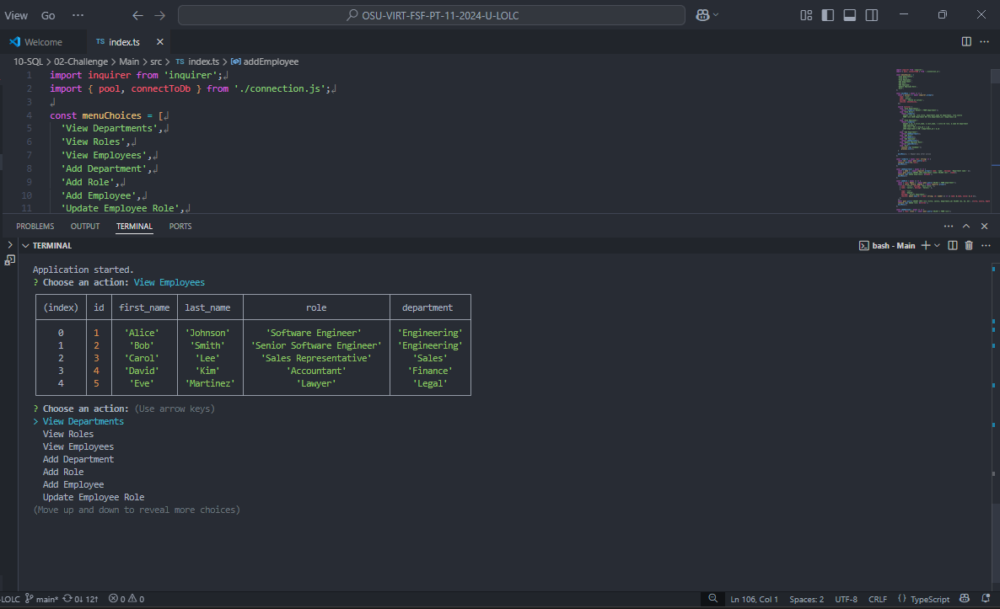

# Employee Tracker

A command-line application built with TypeScript, Node.js, and PostgreSQL that helps manage a company's departments, roles, and employees. Users can view and add data directly through a simple terminal menu.

## Table of Contents

- [Features](#features)
- [Technologies Used](#technologies-used)
- [Getting Started](#getting-started)
- [Database Setup](#database-setup)
- [Usage](#usage)
- [Environment Variables](#environment-variables)
- [Screenshots](#screenshots)
- [License](#license)

## Features

- View all departments, roles, and employees
- Add a department, role, or employee
- Update an employee's role
- Uses PostgreSQL for data storage and Inquirer for a clean CLI interface

## Technologies Used

- TypeScript
- Node.js
- Inquirer
- PostgreSQL (`pg` module)
- ts-node

## Getting Started

### 1. Clone the repository

```bash
git clone https://github.com/iaplesnyc/10-SQL-Employee-Tracker.git
cd 10-SQL-Employee-Tracker
```

### 2. Install dependencies

```bash
npm install
```

## Database Setup

1. Open PostgreSQL in your terminal.
2. Run the schema and seeds files:

```sql
\i db/schema.sql
\i db/seeds.sql
```

Make sure your PostgreSQL server is running locally and you have a user and database configured.

## Usage

To run the application:

```bash
npm start
```

You will see an interactive menu in your terminal to perform various actions like viewing or modifying the employee database.

## Environment Variables

Create a `.env` file in the root directory with the following:

```env
DB_USER=your_postgres_username
DB_PASSWORD=your_postgres_password
DB_NAME=employee_db
```

Refer to the provided `.env.EXAMPLE` for guidance.

## Screenshot & Walkthrough Video

The screenshot below shows the interactive CLI in action, and the walkthrough video provides a full demo of the app’s features.
- [Walkthrough Video](https://drive.google.com/file/d/1CYI2UfsE8FFCC-L0X5WyNg6o5LxCBel6/view?usp=sharing)



